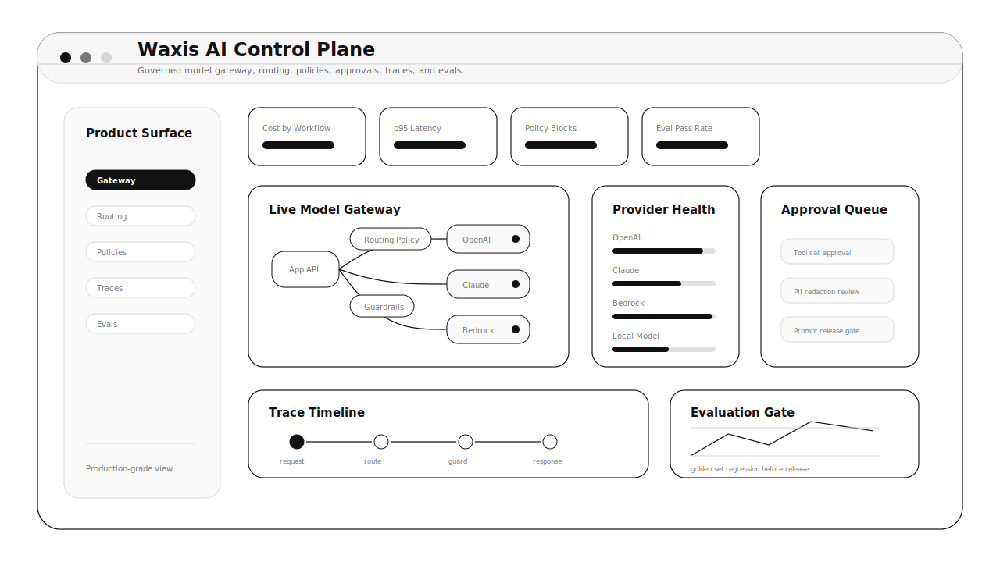
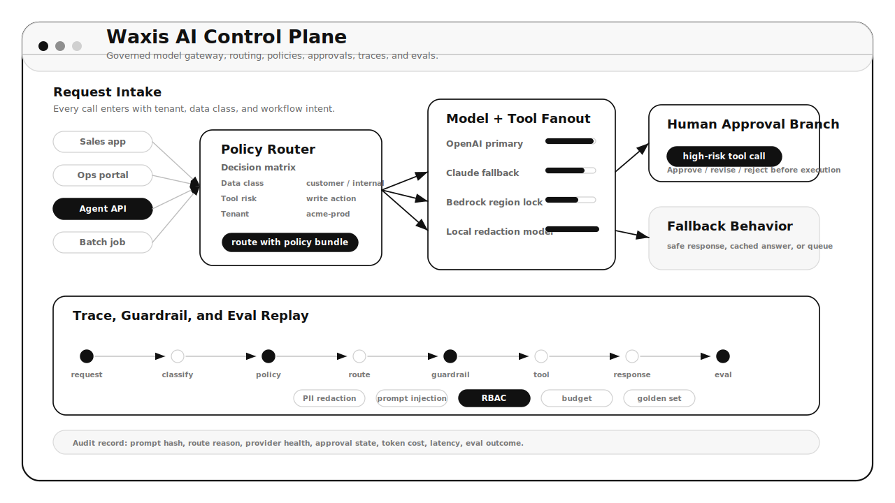
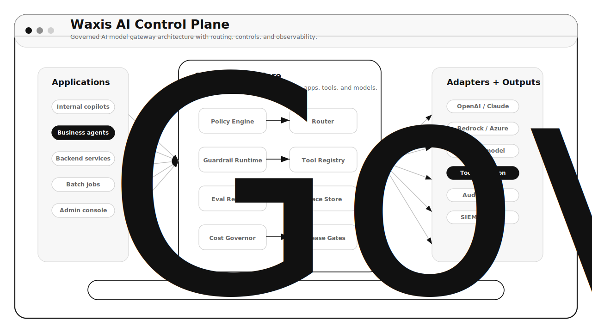

# Waxis AI Control Plane

Enterprise AI infrastructure for teams that need model access, routing, guardrails, observability, approvals, and evaluation in one governed layer.

## Product Preview

## What It Is

Waxis AI Control Plane sits between business applications and AI providers. Instead of letting every team connect directly to OpenAI, Anthropic, Bedrock, local models, tools, and agents, the control plane gives the company one production layer for:

- Model gateway and provider routing
- Prompt and configuration versioning
- Guardrails and policy enforcement
- Tool connector registry and approval gates
- Traces, cost, latency, and quality monitoring
- Evaluation and release checks before changes go live

## What Users See

The main dashboard is built for platform, security, and product teams. A user can quickly see:

- Which workflows are calling which models
- Whether providers are healthy or failing over
- Which policies blocked, warned, redacted, or escalated requests
- How much each project, workflow, model, and provider costs
- What traces failed and why
- Which prompt or routing changes need evaluation or approval

## Core Product Screens

- Gateway Console: provider credentials, model adapters, traffic, fallback, and quotas
- Routing Studio: rules by workflow, tenant, data class, cost target, latency, and risk level
- Prompt Registry: prompt versions, model settings, output schemas, review states, and rollout history
- Guardrail Center: PII, prompt injection, blocked topics, tool permissions, and human approval policies
- Trace Explorer: model calls, tool calls, retrieval, approvals, errors, token usage, and cost
- Evaluation Lab: golden datasets, replay, regression reports, and release gates
- Budget Monitor: spend by workspace, project, provider, model, workflow, and cost center

## A Typical Workflow

1. A developer sends a model request to the Waxis gateway instead of directly calling a provider.
2. The gateway classifies the workflow, checks policy, and selects the right model/provider.
3. Guardrails inspect the request, retrieved context, generated output, and proposed tool calls.
4. High-risk tool calls go to a human approval queue.
5. The full run is traced with latency, tokens, cost, routing reason, and policy outcome.
6. Failed or risky examples can be replayed in the Evaluation Lab before a new prompt/model version ships.

## Who It Is For

- AI platform owners standardizing model access
- Engineering teams building AI products and agents
- Security and compliance teams reviewing AI risk
- Product teams comparing quality, latency, and cost
- Operations leaders managing AI spend and reliability

## MVP Shape

The first version should feel like a serious internal AI platform: one API, one admin console, one trace system, and one evaluation workflow. It should be simple enough for developers to adopt quickly, but strict enough for production governance.

## Product Requirements

The complete product requirements document is here:

- [PRD.md](./PRD.md)

## Research Basis

This repo uses a June 2026 research snapshot across official AI platform, safety, observability, and enterprise-agent sources, including NIST AI RMF, OWASP LLM Top 10, MCP, OpenAI Agents/File Search, Anthropic caching/rate-limit guidance, and Amazon Bedrock Guardrails.
